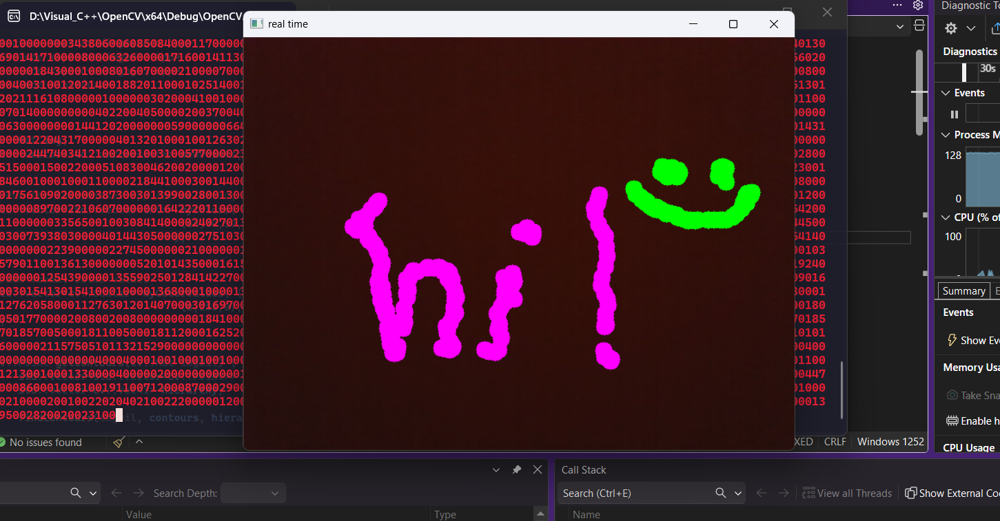
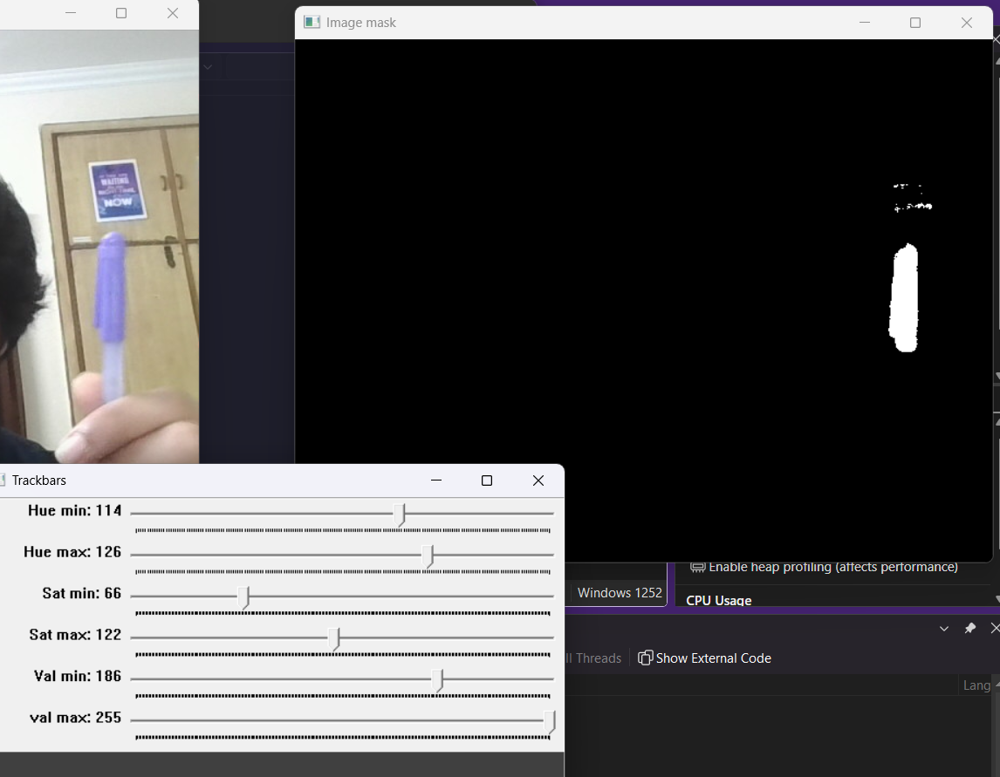
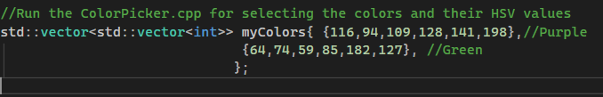

# 🎨🖌️ Virtual-Painter

---

📷💻 I used OpenCV in C++ to make a Virtual Painting project.
This enables us to "draw in air".

---

### ❗ NOTE:
- This works by detecting the colors of pen that you are going to use to draw, sets a contour to the specified colors, draws a bounding box around the pens
then draws the desired color.
- You will have to configure the color yourself and you can do it by:
    1. I have made a 'ColorPicker.cpp' file, run that and you will see the options for HSV values and to mask the color to detect it.
    2. Adjust the values accordingly the way you want and for the color you want to detect, the HSV values will be printed to the console continuously so you can copy from there after adjusting. 
    3. Paste the HSV values in the 'myColors' Vector matrix inside the 'VirtualPaint.cpp'. 
    4. 'VirtualPaint.cpp' is the main file that needs to be build to execute the project.

  ---

  ## 📝 License

  MIT license
